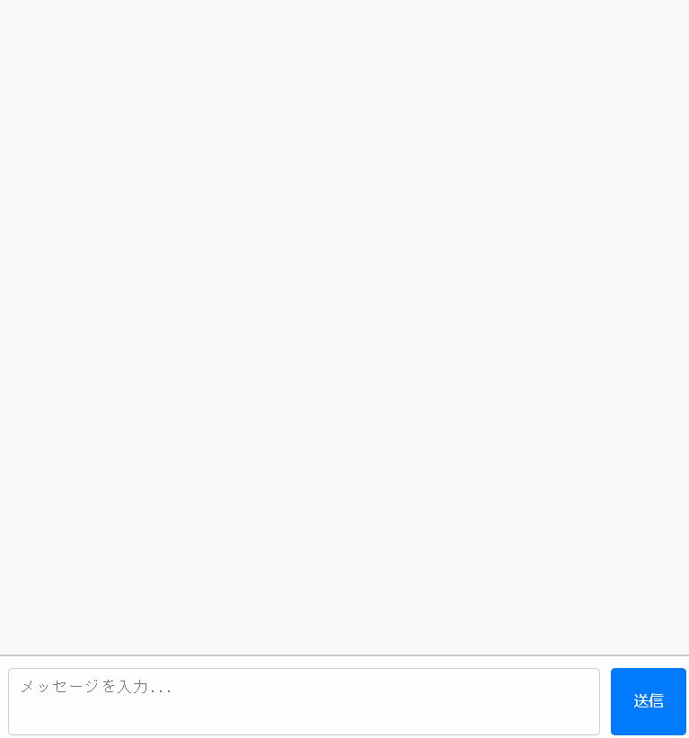

# 練習問題 15 章 15.11-15

## 問題 15.11-15.1 💻🖋️

[15.1-3.1](../ch15.01-03/ex01/) で ToDo 管理アプリケーションを作成したが、ここではこれをサーバ/クライアント型の構成に変更する。
サーバ側はあらかじめ用意してあるので、クライアント側を作成するのが課題となる。

サーバを以下のコマンドで実行し、http://localhost:3000/ にアクセスすると `contents/index.html` のコンテンツをロードすることができる。

```sh
node ex01/server.js
```

このサーバは同じホストの同じポートに以下の仕様の HTTP API を公開している。
リクエスト/レスポンスともに、ボティの Content-Type は `application/json; charset=UTF-8` である。

**オブジェクト仕様**

`Task`: 以下の属性を持つオブジェクトであり、ToDo リストの各項目に該当する

- `id` (`number`): タスクを識別する ID
- `name` (`string`): タスク名
- `status`: (`"active" | "completed"`): タスクの状態

**API 仕様**

タスクの一覧を取得する

- メソッド: `GET`
- パス: `/api/tasks`
- 成功レスポンス
  - ステータスコード: `200`
  - ボディ: 以下の属性を持つオブジェクト
    - `items` (`Task[]`): 現在保持されているタスクの一覧

タスクの ID を指定して取得する

- メソッド: `GET`
- パス: `/api/tasks/{id}`
- 成功レスポンス
  - ステータスコード: `200`
  - ボディ: `Task` オブジェクト

タスクを新規作成する

- メソッド: `POST`
- パス: `/api/tasks`
- リクエスト
  - ボティ: `Task` オブジェクト
    - `name` 属性のみ必要
- 成功レスポンス
  - ステータスコード: `201`
  - ボディ: `Task` オブジェクト
    - `status` の値は `active` である

タスクを一部更新する

- メソッド: `PATCH`
- パス: `/api/tasks/{id}`
- リクエスト
  - ボティ: `Task` オブジェクト
    - ただし、`Task` オブジェクトの `id` 以外の属性の内、更新対象の属性のみがあれば良い
    - リクエストボティに存在しない属性は元の値を維持する
- 成功レスポンス
  - ステータスコード: `200`
  - ボディ: 更新後の `Task` オブジェクト

タスクを削除する

- メソッド: `DELETE`
- パス: `/api/tasks/{id}`
- 成功レスポンス
  - ステータスコード: `204`

なお、上記の API はエラー発生時には以下のレスポンスを返す

- エラーレスポンス
  - ステータスコード: `400` - `499`
  - ボディ: 以下の属性を持つオブジェクト
    - `message` (`string`): エラーメッセージ

**問題**

1. `contents/index.js` を変更し、上記の API を `fetch`を使って呼び出すことで、ToDo リストの状態をクライアントではなくサーバ側で管理する ToDo アプリケーションを完成させなさい。ただし index.html ファイルは編集してはいけない。サーバからエラーレスポンスが返却されたときは、ToDo リストの表示を更新させずエラーの内容を `alert` で表示する。
2. このサーバでは Cookie を使ってクライアントのセッションを識別し、タスク一覧をセッションごとに分離して管理する簡易的な認証/認可を行っている。サーバが設定している Cookie の値は `sid=<セッションに一意に割り当てた ID>; SameSite=Lax; Path=/; HttpOnly;` である。ToDo アプリでいくつかのタスクを作成した後、以下に挙げる操作を実施したとき、それぞれどのような結果になるか記載し、その理由を説明しなさい。
   - index.js で`document.cookie` プロパティを `console.log`で表示する
   - ブラウザの開発者コンソールで http://localhost:3000/ の Cookie を表示する
   - ToDo アプリのタブをリロードする
   - 同一ブラウザの異なるタブやウィンドウで http://localhost:3000/ を開いて ToDo リストの状態を確認する
   - シークレットウィンドウや異なるブラウザで http://localhost:3000/ を開いて ToDo リストの状態を確認する
   - http://127.0.0.1:3000/ を開いて ToDo リストの状態を確認する

**出題範囲: 15.11.1, 15.12.2**

## 問題 15.11-15.2 💻

この問題では、[問題 15.11-15.1](#問題-1511-151-️) と同様な仕様のサーバが用意してある。
ただし、このサーバは、`/api` 以下のパスのリクエストに対して、1/3 ずつの同確率で以下のレスポンスを返す。

- 正常なレスポンス
- ステータスコードが 500 のエラーレスポンス
- レスポンスは正常だが、レスポンスを返すまでに 60 秒かかる

一般に 500 番台のステータスコードはサーバ側でのエラーが発生したことを示しており、リトライで成功する可能性がある。

このサーバに対して、以下を満たすように[問題 15.11-15.1](#問題-1511-151-️) で作成した `contents/index.js` を変更しなさい。

- API からステータスコード 500 番台のエラーレスポンスが返ってきた場合は [問題 11.16](../ch11/README.md#問題-1116-) で作成した `retryWithExponentialBackoff` を流用 (必要に応じて変更) して `fetch` のリトライを行う
- リクエスト送出から 3 秒以上経過してもレスポンスを受信できない場合はリクエストをキャンセルし、リクエストがタイムアウトしたことを `alert` に表示する
- 通信やリトライが完了するまで ユーザが ToDo リストの追加/削除/変更、及びテキストの編集をできないようにする
  - このために `contents/index.html` の変更が必要であれば変更しても良い

**出題範囲: 15.11.1.1, 15.11.1.９**

## 問題 15.11-15.3 💻

この問題では、[問題 15.11-15.1](#問題-1511-151-️) と同様な仕様のサーバが用意してある。
ただし、このサーバは、3000 ポートで HTML や js などのコンテンツを返すが、HTTP API は 3001 ポートで Listen している。

まず、[問題 15.11-15.1](#問題-1511-151-️) で作成した `contents/index.js` を変更して、`fetch` で `http://localhost:3001/<各 API のパス>` にリクエストを送るように変更しなさい。

上記の変更をした後、開発者コンソールを開いて、http://localhost:3000 にアクセスして見ると、HTTP API のリクエストに対してエラーが発生しているはずである。

エラーは、API の URL に対して `OPTIONS` メソッドのリクエストを送り、レスポンスが 404 のため発生している。
このリクエストは [Preflight リクエスト](https://developer.mozilla.org/ja/docs/Glossary/Preflight_request) と呼ばれるものであり、サーバーが CORS プロトコルに対応しているか確認するためのものである。
その結果、コンソールには CORS のエラーが発生した旨のログが出力されているはずである。

(補足: クロスオリジンリクエストでも、[必ず Preflight リクエストが発生するわけではない](https://developer.mozilla.org/ja/docs/Web/HTTP/CORS#%E3%82%A2%E3%82%AF%E3%82%BB%E3%82%B9%E5%88%B6%E5%BE%A1%E3%82%B7%E3%83%8A%E3%83%AA%E3%82%AA%E3%81%AE%E4%BE%8B))

では、以下の変更を行うことで、 CORS エラーを解消し http://localhost:3000 から http://localhost:3001 の API にリクエストを送信できるようにしなさい。

- `contents/index.js` で、`fetch` のオプション設定を変更し、CORS モードでのリクエスト送信と、クロスオリジンでの Cookie の送信を許可する
- `server.js` で以下の箇所を変更して、`http://localhost:3000` からのクロスオリジンリクエストを許可する

  ```js
  // CORS のヘッダを返すミドルウェア
  function corsMiddleware(_url, _req, res) {
    // TODO: CORS に必要なヘッダを複数設定する
    res.setHeader("TODO", "TODO");
    return true;
  }
  ```

  ```js
  http
    .createServer(async function (req, res) {
      await routes(
        // TODO: この行のコメントを外す
        // ["OPTIONS", "/api/*", nopHandler, cors],
        ["GET", "/api/tasks", listTasksHandler, authz, cors],
        ["GET", "/api/tasks/{id}", getTaskHandler, authz, cors],
        ["POST", "/api/tasks", createTaskHandler, authz, cors],
        ["PATCH", "/api/tasks/{id}", patchTaskHandler, authz, cors],
        ["DELETE", "/api/tasks/{id}", deleteTaskHandler, authz, cors]
      )(req, res);
    })
    .listen(3001);
  ```

**出題範囲: 15.1.8.2, 15.11.1.8**

## 問題 15.11-15.4 💻🧪

問題 15.1-3.1 で作成した ToDo 管理アプリケーションを改造しなさい。
ToDo のリストを localStorage に保存し、一度閉じて再度開いても、画面更新しても、ToDo の内容が維持されるようにしなさい。

また、複数のタブで ToDo 管理アプリケーションを開いている状態で、あるタブでの変更が他のタブにも自動的に反映されるようにしなさい。
(例：タブ A とタブ B を開いている状態で、タブ A で ToDo を追加し、タブ B に切り替えると タブ A で追加した ToDo が表示される)

ブラウザの設定で、localStorage の利用を禁止にしてもエラーが発生せず、そのタブを開いている間だけは正常に動くようにしなさい。localStorage で実現していた機能は動かなくても構わない。(Firefox ではすべての Cookie を拒絶すると禁止にできる)

**出題範囲: 15.12.1**

## 問題 15.11-15.5 💻🧪

15.1-3.1 の ToDo 管理アプリケーション を indexedDB を用いて、一度閉じて再度開いても、画面更新しても、ToDo の内容が維持されるようにしなさい。

また、複数のタブで ToDo 管理アプリケーションを開いている状態で、あるタブでの変更が他のタブにも自動的に反映されるようにしなさい。
(例：タブ A とタブ B を開いている状態で、タブ A で ToDo を追加し、タブ B に切り替えると タブ A で追加した ToDo が表示される)

**出題範囲: 15.12.3**

## 問題 15.11-15.6 💻🧪🖋️

[問題 15.11-15.4](#問題-1511-154-) の解答を localStorage ではなく sessionStorage を使うように修正しなさい。

localStorage と sessionStorage それぞれに保存されたデータの有効期限がどのように異なるか、実際に動作確認して結果を記述しなさい。

**出題範囲: 15.12.1**

## 問題 15.11-15.7 💻

書籍では一言しか触れられていないが、[ContentSecurity-Policy (CSP)](https://developer.mozilla.org/ja/docs/Web/HTTP/CSP) はクロスサイトスクリプティング (XSS) やデータインジェクションなどのリスクを軽減するための仕組みで、主にブラウザ上のコンテンツの読み込みを信頼されたコンテンツのみに制限することで実現される。

CSP には様々なディレクティブが存在するが、その中の `script-src` ディレクティブによって有効な JavaScript のソースを指定することができる。

この問題においても、サーバを `node ex07/server.js` のコマンドで実行し、http://localhost:3000/ にアクセスすると `contents/index.html` のコンテンツをロードすることができる。

このコンテンツをブラウザで表示すると、"RICOH", "Hello", "World" の 3 つのアラートを表示するようになっている。
`server.js` の以下の箇所を変更して CSP ヘッダを設定することで、"RICOH" および "Hello" のアラートは表示されるが、 "World" のアラートは表示されないようにしなさい。

```js
// CSP のヘッダを返すミドルウェア
function cspMiddleware(_url, req, res) {
  // TODO: CSP ヘッダを設定する
  // res.setHeader("Content-Security-Policy", "TODO");
  return true;
}
```

**出題範囲: 15.15.3**

## 問題 15.11-15.8 💻

HTTP のようなリクエスト/レスポンス型のプロトコルを、WebSocket で実装し、クライアント間で通信できるようにすることを考える。

WebSocket サーバとしては[ex08/server.js](ex08/server.js)が用意されており、以下のコマンドで実行すると `ws://localhost:3003` で WebSocket サーバが起動する。

```sh
node ex08/server.js
```

この WebSocket サーバはクライアントから受信したメッセージ文字列を、他のクライアントに対して転送するようになっている。ただし、メッセージ転送時にランダムに 0-5 秒の遅延が発生するようになっている。
以下の手順でこのサーバに接続したクライアント間で通信する実装しなさい。

1. WebSocket サーバに文字列データを含むリクエストメッセージを送信する `sendRequest` 関数を実装しなさい。

   - 引数としてリクエスト本文を受け取り、返り値としてレスポンス本文が得られる `Promise<string>` を返すこと。
   - 一定時間内にレスポンスを受信したら、Promise が resolve されること。
   - 一定時間経過時にタイムアウトし、Promise が reject されること。
   - WebSocket の接続が切断した場合、Promise が reject されること。
   - 送信するメッセージの形式は、リクエストが複数並行して送信されてもよいよう考慮すること

   例

   ```js
   const response = await sendRequest("World");
   console.log(response); // -> "Hello, World"
   ```

2. 1.とは別の WebSocket 接続で、WebSocket サーバから転送されたリクエストメッセージを受信してレスポンスを返す実装をしなさい。

   - レスポンス本文は、 リクエスト本文の先頭に `Hello, ` を付加したものを返すこと。
   - どのリクエストに対するレスポンスか、リクエストした側で判別できるようにすること。

3. 1., 2. を利用してリクエストの送信とレスポンスの確認が可能な Web ページを作成しなさい
   - リクエスト本文の入力欄を複数用意し、ボタン押下時に `sendRequest` 関数でを同時にリクエストを送信するできるようにすること。
   - 時間内にレスポンスが返った場合はレスポンス本文を、エラーまたはタイムアウトが発生した場合はその内容を、対応するリクエスト入力欄の横または下に表示すること。

**出題範囲: 15.11.3**

## 問題 15.11-15.9 💻

15.4-10.10 で作成したライフゲームについて、WebSocket を利用して多人数で同期してプレイできるようにしなさい。
サーバ側はあらかじめ用意してあるので、クライアント側を作成するのが課題となる。

[ex09/server.js](ex09/server.js) は、ライフゲームの盤面情報を管理し WebSocket でクライアントと送受信する WebSocket サーバーである。

15.4-10.10 で実装した updateGrid メソッドを server.js にも実装し、以下のコマンドで実行すると ws://localhost:3003 で WebSocket サーバが起動する。

```sh
node ex09/server.js
```

このサーバでは、ゲームが開始されると 1 秒に 10 回盤面を更新し、以下のメッセージをすべてのクライアントに送信する。

```json
  {
    "type": "update",
    "grid": {盤面を表すboolean二次元配列}
  }
```

また、クライアントからは WebSocket で以下のメッセージを受信し、ゲームの盤面・進行状態に反映する。

- セルの反転（盤面クリック時）

```json
  {
    "type": "toggle",
    "row": {セルの行数},
    "col": {セルの列数}
  }
```

- ゲームの一時停止

```json
{
  "type": "pause"
}
```

- ゲームの開始・再開

```json
{
  "type": "start"
}
```

**出題範囲: 15.11.3**

## 問題 15.11-15.10 💻

[問題 15.4-10.9](../ch15.04-10/README.md) の画像変換処理を、Web Worker で処理するように修正しなさい。
可能であればページ内に動くオブジェクトを配置し、画像変換中にメインスレッドがブロックされていないことを確認しなさい。

**出題範囲: 15.13**

## 問題 15.11-15.11 💻

15.14 のサンプルコードを参考に、マンデルブロ集合以外のフラクタル図形(例: シェルピンスキーのギャスケット)
を描画するページを作成しなさい。

参考: [フラクタルの例](https://ja.wikipedia.org/wiki/%E3%83%95%E3%83%A9%E3%82%AF%E3%82%BF%E3%83%AB#%E3%83%95%E3%83%A9%E3%82%AF%E3%82%BF%E3%83%AB%E3%81%AE%E4%BE%8B)

**出題範囲: 15.14**

## 問題 15.11-15.12 💻

指定したファイルを OneDrive へアップロードするページを作成しなさい。
API を実行するためのアクセストークンは、[Graph Explorer](https://developer.microsoft.com/en-us/graph/graph-explorer) で取得したものをユーザが入力できるようにしなさい。

**出題範囲: 15.11.1**

## 問題 15.11-15.13 💻

[Ollama](https://ollama.com/) はローカル環境で LLM が使えるツールである。
Ollama を使って、生成 AI とのチャットできる Web アプリケーションを作りなさい。

LLM のモデルは[gemma:2B](https://ollama.com/library/gemma) 程度を用いなさい。以下のコマンドでローカル環境に LLM(gemma:2B) が起動する。

```
ollama run gemma:2b
```

ローカル環境に LLM のモデルが起動すると、Ollama の[REST API](https://github.com/ollama/ollama?tab=readme-ov-file#rest-api)が使用できる。

[Generate a chat completion](https://github.com/ollama/ollama/blob/main/docs/api.md#generate-a-chat-completion) API を使って、LLM の応答を逐次表示する以下のような UI をもつ Web アプリケーションを実装しなさい。逐次表示に関連するパラメータは`stream`パラメータである(デフォルトで有効)。



**出題範囲: 15.11.1**

## 問題 15.11-15.14 💻

EventSource でサーバーからメッセージを受信し、表示する UI を実装しなさい。

問題 15.11-15.01 と同様にサーバーは用意している。起動方法も同様である。

http://localhost:3000/message にリクエストすると EventSource でメッセージを受信できる。

index.js のコードを完成させて、通信ボタンを押下するとサーバーと通信を開始し、
通信中は通信ボタンが非活性になるように実装しなさい。

**出題範囲: 15.11.2**

## 問題 15.11-15.15 🖋

Slack や O365 の API は機密情報をヘッダーで指定する。パスやクエリでないのは何故かセキュリティの観点で記載しなさい。

**出題範囲: 15.11.1**

## 問題 15.11-15.16 🖋️

オリジン間リソース共有（CORS）について、以下の問いに答えなさい。

1. クロスオリジンリクエストに制約が無かった場合、どのような問題が発生するか述べなさい
2. クロスオリジンリクエストで メソッド(`POST`/`GET`)やリクエストの内容によって Preflight リクエストの有無が異なるのは何故か、その理由を述べなさい

**出題範囲: 15.11.1**

## 問題 15.11-15.17 🖋

実際のサービスの通信をデベロッパーツールなどで眺めて CORS の設定を確認しなさい。

(金融系の認証ページなどで CORS の設定がされていることが多い)

**出題範囲: 15.11.1**

## 15.11-15.18 🖋️

書籍の 15.12 の説明には以下のような説明がある。

> 本章で紹介するクライアントサイドストレージのいずれも、暗号化機能を備えていませ ん。保存したデータは、ユーザのデバイス上に暗号化されていない形式で存在します。

では、Web アプリケーションがユーザの機密情報をセキュアに扱うためにはどのようなことが必要になるか記述しなさい。ブラウザでの対応に限らず、Web アプリケーション全般を対象として考えること。

**出題範囲: 15.12**
