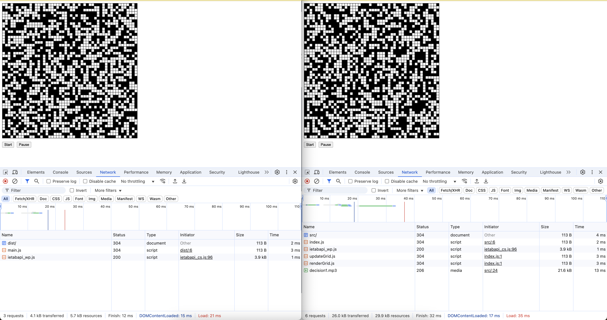

# バンドルしたコードと元のコードを比較し、どのような処理が行われたかを確認しなさい。

次のような処理が行われている。
・1つの即時実行関数になっている
・改行や空白（スペース）を削除
・変数名を最小限に変更（一文字）
・renderGrid() → e()
・pauseButton → o

以上のような処理によって軽量化されている。当然だがJavaScriptが許容できる範囲の変更であって「click」等のイベント名やpath、要素取得のためのクエリなどはそのままになっている。

# バンドル前後それぞれのコードを利用するページをローカルサーバで配信してブラウザから閲覧できるようにしなさい。開発者ツールで `ネットワーク` タブを開き、スクリプトのダウンロード時間、ページの読み込み完了時間について比較しなさい。

`dist/index.html`を作成して`main.js`をスクリプトとして呼び出すよう変更した。次に動作確認時のコンソールログを示す（左がバンドル後、右がバンドル前）。

- バンドル前
  - `src/`: 4ms
  - `index.js`: 2ms
  - `ietabapi_wp.js`: 1ms
  - `updateGrid.js`: 3ms
  - `renderGrid.js`: 3ms
  - `decision1.mp3`: 13ms
  - ページの読み込み完了までの時間: 26ms
- バンドル後
  - スクリプトのダウンロード時間
    - `dist/`: 2ms
    - `main.js`: 3ms
    - `ietabapi_wp.js`: 1ms
  - ページの読み込み完了までの時間: 6ms

バンドルすることでページの読み込み完了までの時間が20ms短縮している。
