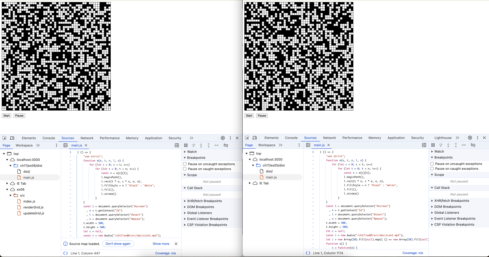
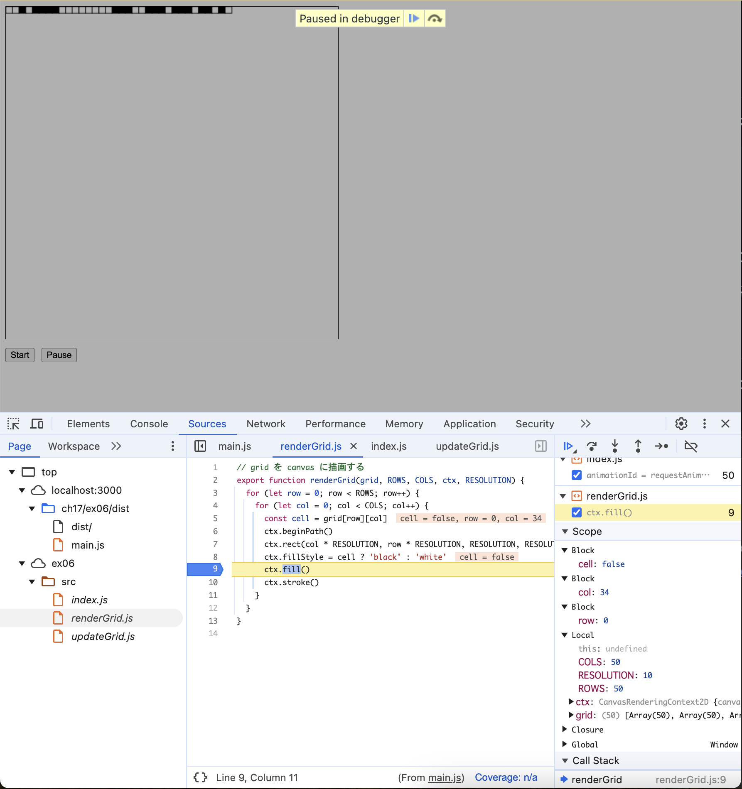

次のコマンドで生成

```sh
$ npx webpack --devtool source-map
```

# 開発者ツールで `ソース` タブ(Chrome, Edge, Safari) または `デバッガー` タブ(Firefox) を開き、ソースコードファイルがどのように表示されるかを確認しなさい。

次にソースマップを生成した`ex06/dist/index.html`(左)と、生成していない`ex06/dist/index.html`(右)の画像を示す。



ソースマップを生成したページでは、ソースの階層の中にバンドルに使用した`index.js`と`renderGrid.js`、`updateGrid.js`がある。

# バンドルしたコードの実行中に、バンドル前のソースコードファイルに基づいたブレークポイントの設定や変数の値の確認等のデバッグが可能か確認しなさい。

Chromeの開発者ツールからブレークポイントを設定できることを確認した（次の画像）。まだ画像右下の「SCOPE」の欄にソースコードで定義した定数や変数の値を確認できるようになっている。


